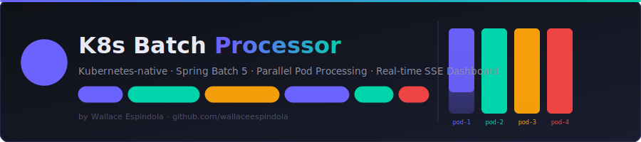
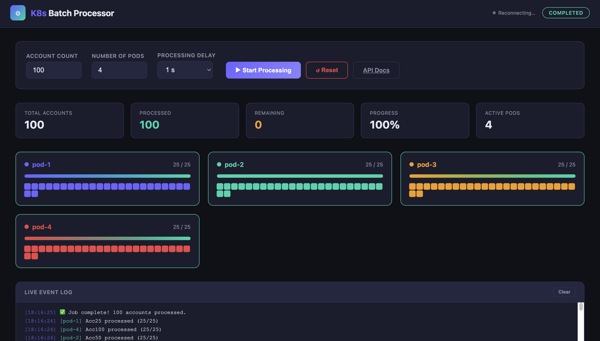

# K8s Batch Processor

<p align="center">
  
</p>

<p align="center">
  <a href="https://github.com/wallaceespindola/k8s-batch-processor/actions/workflows/build.yml">
    
  </a>
  <a href="https://github.com/wallaceespindola/k8s-batch-processor/actions/workflows/codeql.yml">
    
  </a>
  
  
  
  
  
  
  <a href="https://github.com/wallaceespindola/k8s-batch-processor/blob/main/LICENSE">
    
  </a>
</p>

A **Kubernetes-native Spring Batch application** that demonstrates distributed, parallelized batch processing with a real-time live dashboard.

Bank accounts are generated on demand, then distributed across configurable "pods" (Spring Batch partitions), each processing their slice in parallel. The frontend shows real-time progress via **Server-Sent Events**, with one block per account in each pod's progress bar.

---

## Architecture

```
┌─────────────────────────────────────────────────────────┐
│                  Browser (HTML/CSS/JS)                  │
│  ┌──────────────────────────────────────────────────┐   │
│  │ Control Panel: account count + pod count + start │   │
│  │ Live Progress: N progress bars (one per pod)     │   │
│  │ Each block = 1 bank account                      │   │
│  └──────────────────────────────────────────────────┘   │
│                  SSE (/api/sse/progress)                │
└───────────────────────┬─────────────────────────────────┘
                        │
┌───────────────────────▼─────────────────────────────────┐
│              Spring Boot Application (8080)             │
│                                                         │
│  REST API  ───────────────────────────────────────────  │
│  POST /api/batch/start  → generate accounts + run job   │
│  GET  /api/batch/status → current job + partition state │
│  POST /api/batch/reset  → clear all data                │
│                                                         │
│  Spring Batch Job                                       │
│  ┌──────────────────────────────────────────────────┐   │
│  │  partitionedStep (gridSize = podCount)           │   │
│  │  ┌──────────┐  ┌──────────┐  ┌──────────┐        │   │
│  │  │  pod-1   │  │  pod-2   │  │  pod-N   │  ...   │   │
│  │  │ Acc1-25  │  │ Acc26-50 │  │ AccX-Y   │        │   │
│  │  │ sleep 1s │  │ sleep 1s │  │ sleep 1s │        │   │
│  │  │ per acct │  │ per acct │  │ per acct │        │   │
│  │  └────┬─────┘  └────┬─────┘  └────┬─────┘        │   │
│  │       └─────────────┴─────────────┘              │   │
│  │         After each write → SSE broadcast         │   │
│  └──────────────────────────────────────────────────┘   │
│                                                         │
│  H2 In-Memory Database                                  │
│  bank_accounts (id, account_number, status, pod_name,   │
│                 partition_id, processed_at, created_at) │
└─────────────────────────────────────────────────────────┘
```

### Parallelization Strategy — How Pods Consume Accounts

The core of this application is **Spring Batch local partitioning** with a thread-per-pod model. Here is the full sequence:

#### 1. Account Generation
When the user clicks **Start**, the backend generates N `BankAccount` rows in H2 with `status = PENDING`. Each row gets an auto-incremented `id` (e.g., 1 to 100 for 100 accounts).

#### 2. Partitioning — Dividing the Load
`AccountPartitioner` implements Spring Batch's `Partitioner` interface. It is called with `gridSize = podCount` (the number chosen by the user). It:
- Fetches all account IDs from the database (sorted ascending)
- Divides them into P contiguous ID ranges, distributing any remainder across the first partitions

```
100 accounts, 4 pods:
  pod-1 → IDs  1–25   (25 accounts)
  pod-2 → IDs 26–50   (25 accounts)
  pod-3 → IDs 51–75   (25 accounts)
  pod-4 → IDs 76–100  (25 accounts)

101 accounts, 4 pods (remainder = 1):
  pod-1 → IDs  1–26   (26 accounts)  ← gets the extra
  pod-2 → IDs 27–51   (25 accounts)
  pod-3 → IDs 52–76   (25 accounts)
  pod-4 → IDs 77–101  (25 accounts)
```

Each partition produces an `ExecutionContext` carrying `minId`, `maxId`, `partitionId`, `podName`, and `total`.

#### 3. Dynamic Grid Size via `@JobScope`
The partitioned step is annotated `@JobScope`, which means Spring creates a **new Step bean instance per job execution**. This allows injecting `podCount` directly from `JobParameters`:

```java
@Bean
@JobScope
public Step partitionedStep(...,
    @Value("#{jobParameters['podCount']}") Long podCount) {
    // gridSize set at runtime, not at application startup
    return new StepBuilder(...)
        .partitioner(workerStep.getName(), partitioner)
        .gridSize(podCount.intValue())
        .taskExecutor(executor)   // pool size = podCount
        .build();
}
```

#### 4. Parallel Execution — `ThreadPoolTaskExecutor`
A `ThreadPoolTaskExecutor` with `corePoolSize = podCount` is created fresh per job. Spring Batch dispatches each `ExecutionContext` to a separate thread, so all P partitions run **simultaneously**:

```
Thread batch-pod-1 → reads Acc1–Acc25   → processes → writes
Thread batch-pod-2 → reads Acc26–Acc50  → processes → writes   } all at once
Thread batch-pod-3 → reads Acc51–Acc75  → processes → writes
Thread batch-pod-4 → reads Acc76–Acc100 → processes → writes
```

#### 5. Per-Pod Processing — Chunk Size 1
Each worker thread runs a chunk-oriented step with **chunk size = 1**:
- **Reader** (`@StepScope` `RepositoryItemReader`): reads accounts from its `minId–maxId` range with `status = PENDING`, one at a time
- **Processor** (`@StepScope`): sleeps 1 second (simulating real work), then stamps `status = PROCESSED`, `processedAt = now()`, and `podName`
- **Writer** (`@StepScope`): persists the account, then queries the count of processed accounts for this partition and fires an **SSE event** to all connected browsers

Chunk size 1 ensures every single account triggers an immediate DB write and SSE broadcast, giving the frontend a live, per-account update.

#### 6. Real-Time Progress via SSE
`ProgressService` maintains a `CopyOnWriteArrayList<SseEmitter>`. After each write, `AccountItemWriter` calls `progressService.broadcast(event)`, which sends a JSON event to every connected browser tab:

```json
{ "type": "account", "accountNumber": "Acc42", "podName": "pod-2",
  "partitionId": 2, "processed": 10, "total": 25, "percent": 40,
  "processedAt": "2025-01-15T10:30:45" }
```

The browser updates the relevant pod's progress bar block-by-block, with no polling.

#### 7. Kubernetes Auto-Scaling (HPA)
In a real Kubernetes deployment, the `HorizontalPodAutoscaler` scales the application's replica count between 1 and 8 based on CPU (≥ 60%) and memory (≥ 70%) utilization. Combined with Spring Batch remote partitioning (e.g., via Kafka or HTTP), each pod replica would claim and process its own partition independently — exactly the same logical model, but across physical machines.

### Key Design Decisions

| Concern | Decision |
|---|---|
| Parallelism model | Spring Batch `@JobScope` partitioned step + `ThreadPoolTaskExecutor` (one thread = one pod) |
| Dynamic pod count | `gridSize` read from `JobParameters['podCount']` at job-launch time via `@JobScope` |
| Partition algorithm | Contiguous ID ranges; remainder distributed round-robin to first partitions |
| Chunk size | 1 — every account triggers an immediate DB commit + SSE push |
| Real-time streaming | `SseEmitter` (Server-Sent Events) — simpler than WebSocket for one-directional push |
| State durability | `BankAccount.podName` + `partitionId` + `processedAt` persisted at write time |
| K8s scalability | HPA scales replicas 1–8 on CPU/memory; remote partitioning path for true multi-pod |

---

## Tech Stack

### Backend
| Technology | Version | Role |
|---|---|---|
| Java | 21 (LTS) | Language — virtual threads ready, records, sealed classes |
| Spring Boot | 3.4.1 | Application framework, auto-configuration, embedded Tomcat |
| Spring Batch | 5.2 (via Boot) | Partitioned step, chunk-oriented processing, job repository |
| Spring Data JPA | 3.4 (via Boot) | ORM, `RepositoryItemReader`, derived queries |
| Spring Web MVC | 6.2 (via Boot) | REST controllers, `SseEmitter` for streaming |
| Spring Actuator | 3.4 (via Boot) | `/actuator/health`, `/actuator/metrics`, readiness/liveness probes |
| Spring DevTools | 3.4 (via Boot) | Hot reload during development |
| H2 Database | 2.x | In-memory relational DB — Spring Batch schema + app data |
| Hibernate | 6.6 (via Boot) | JPA provider, DDL auto-creation |
| Lombok | latest | `@Slf4j`, `@Builder`, `@RequiredArgsConstructor` boilerplate reduction |
| springdoc-openapi | 2.7.0 | Swagger UI + OpenAPI 3 spec generation |
| Jakarta Validation | 3.1 (via Boot) | `@Min`/`@Max` on request DTOs |
| JaCoCo | 0.8.12 | Test coverage reporting |

### Frontend
| Technology | Role |
|---|---|
| HTML5 / CSS3 / Vanilla JS | Self-contained dashboard (`static/index.html`) — no build step |
| Server-Sent Events (SSE) | One-directional real-time push from server to browser |
| CSS Custom Properties | Dark theme, pod-specific color palette |
| Fetch API | REST calls to start/reset the job |

### Infrastructure & CI/CD
| Technology | Role |
|---|---|
| Docker | Multi-stage build image (builder: JDK 21, runtime: JRE 21 Alpine) |
| Docker Compose | Single-service local stack |
| Kubernetes | Deployment, ClusterIP/NodePort service, HPA (auto-scale 1–8 replicas) |
| GitHub Actions | Build + test pipeline, Docker image build verification |
| CodeQL | Static security analysis on every push to `main` |
| Dependabot | Weekly automated dependency updates (Maven, Docker, GitHub Actions) |
| Maven | Build tool, Surefire (tests), JaCoCo (coverage) |

---

## Simulated mode vs Real Kubernetes mode

This project can run in two fundamentally different modes. Understanding the difference is essential before choosing a run script.

---

### Simulated mode (local — `run.sh` / `run.bat` / `run.ps1` / Maven)

The entire application runs as **a single Java process** on your machine. No Docker, no Kubernetes.

When you click **Start** and choose *Number of Pods = 4*, the application creates **4 JVM threads** — one per Spring Batch partition. These threads are labelled `pod-1` through `pod-4` in the dashboard, but they are **not** real Kubernetes pods. They share the same JVM heap, the same H2 in-memory database, and the same network interface.

```
Your machine
└── JVM process (java -jar)
    ├── Thread batch-pod-1  →  accounts  1–25   (simulated pod)
    ├── Thread batch-pod-2  →  accounts 26–50   (simulated pod)
    ├── Thread batch-pod-3  →  accounts 51–75   (simulated pod)
    └── Thread batch-pod-4  →  accounts 76–100  (simulated pod)
         ↑ all share the same H2 database and JVM
```

**What is simulated**: the parallel distribution of work across named workers, the SSE progress per pod, the partition algorithm.

**What is NOT real**: Kubernetes, containers, network isolation, independent JVMs.

**Use this mode for**: development, debugging, demos on a laptop without Docker or minikube installed.

---

### Real Kubernetes mode (`run-docker.sh` / `run-docker.bat` / `run-docker.ps1`)

The application is packaged into a **Docker image** and deployed to a local Kubernetes cluster as a Kubernetes `Deployment`. Multiple K8s pods (container replicas) are started — each is an independent OS process with its own JVM, its own memory, and its own H2 database.

```
local K8s cluster (colima / minikube)
├── K8s pod 1  (Spring Boot container)  ← serves HTTP requests (load-balanced)
├── K8s pod 2  (Spring Boot container)  ← standby / load-balanced
├── K8s pod 3  (Spring Boot container)  ← standby / load-balanced
└── K8s pod 4  (Spring Boot container)  ← standby / load-balanced
     ↑ each pod has its own isolated JVM and H2 database
```

**What is real**: Docker containers, Kubernetes Deployment, Services, HPA auto-scaling, `kubectl` management, container resource limits, readiness/liveness/startup probes.

**Current limitation**: because each pod uses an **in-memory H2 database**, pods cannot share account data. When you hit *Start*, the K8s Service load-balances the request to **one** of the pods, and that pod runs all batch partitions internally as threads. The other pods are idle for that job.

**What it would take to truly distribute across pods**: replace H2 with a shared **PostgreSQL** (all pods read/write the same table) and implement **Spring Batch remote partitioning** (a manager pod assigns partitions to worker pods via Kafka or HTTP). That path is documented in the *Running on Kubernetes* section.

---

### Side-by-side comparison

| | Simulated (local) | Real Kubernetes |
|---|---|---|
| Start command | `./run.sh` · `run.bat` · `mvn spring-boot:run` | `./run-docker.sh` · `run-docker.bat` · `.\run-docker.ps1` |
| "Pods" are | JVM threads inside 1 process | Docker containers managed by K8s |
| Database | 1 shared H2 in-memory | 1 H2 per pod (isolated) |
| Batch partitioning | Thread-based (within 1 JVM) | Thread-based within the pod that handles the request |
| K8s / Docker needed | No | Yes — colima (macOS) or minikube + Docker |
| HPA auto-scaling | No | Yes (CPU ≥ 60 % · memory ≥ 70 %) |
| True load distribution | ✅ (threads share DB) | ⚠️ (pods isolated — shared DB needed) |
| Good for | Dev · debug · demos | K8s learning · container ops · HPA demos |

---

## Quick Start

## Running locally

### Prerequisites
- Java 21+
- Maven 3.9+

---

### Option 1 — Maven (any OS)

```bash
# Clone
git clone https://github.com/wallaceespindola/k8s-batch-processor.git
cd k8s-batch-processor

# Run in foreground (dev mode, hot-reload via DevTools)
mvn spring-boot:run

# Or: build JAR then run
mvn clean package -DskipTests
java -jar target/k8s-batch-processor-*.jar
```

Open the dashboard → **http://localhost:8080**

---

### Option 2 — Shell scripts (macOS / Linux)

The scripts build the JAR automatically if none is found, start the app in the background, and poll `/actuator/health` until the app is ready.

```bash
# Start
./run.sh

# Stop (graceful SIGTERM → SIGKILL after 20 s)
./stop.sh
```

Or via Make:

```bash
make run    # calls run.sh
make stop   # calls stop.sh
```

---

### Option 3 — Batch scripts (Windows cmd)

```cmd
:: Start
run.bat

:: Stop
stop.bat
```

Or via Make:

```cmd
make run-win
make stop-win
```

---

### Option 4 — PowerShell scripts (Windows PowerShell 5.1+)

```powershell
# Start
.\run.ps1

# Stop
.\stop.ps1
```

Or via Make:

```cmd
make run-ps
make stop-ps
```

> If PowerShell blocks unsigned scripts, run once:
> `Set-ExecutionPolicy RemoteSigned -Scope CurrentUser`
> The Makefile targets pass `-ExecutionPolicy Bypass` automatically.

---

### Option 5 — Kubernetes via Docker / colima / minikube (run-docker scripts)

These scripts auto-detect your local Kubernetes runtime (**colima** on macOS or **minikube** everywhere), build the Docker image, deploy the K8s manifests, scale to N pods and open the dashboard — all in one command.

> **Prerequisites (macOS — colima)**
> ```bash
> brew install colima docker kubectl
> ```
> **Prerequisites (any OS — minikube)**
> Install [minikube](https://minikube.sigs.k8s.io/docs/start/) and [kubectl](https://kubernetes.io/docs/tasks/tools/).

```bash
# macOS / Linux
./run-docker.sh          # 4 pods (default)
./run-docker.sh 2        # 2 pods

./stop-docker.sh
./stop-docker.sh --stop-colima       # also stop colima (macOS)
./stop-docker.sh --delete-colima     # destroy colima VM (macOS)
./stop-docker.sh --stop-minikube     # also pause minikube
./stop-docker.sh --delete-minikube   # destroy minikube cluster
```

```cmd
:: Windows cmd
run-docker.bat 4
stop-docker.bat --stop-minikube
```

```powershell
# Windows PowerShell
.\run-docker.ps1 -Pods 4
.\stop-docker.ps1 -StopMinikube
.\stop-docker.ps1 -DeleteMinikube
```

Via Make (Linux/macOS):

```bash
make run-docker            # default 4 pods
make run-docker PODS=2     # custom count
make stop-docker
```

> **Architecture note**: in this POC each K8s pod runs the full Spring Boot app with its own in-memory H2 database. Batch partitioning is **thread-based within whichever pod serves the request**. The *Number of Pods* slider in the dashboard controls the thread-pool (partitions) inside that pod — not the number of K8s replicas. True multi-pod distribution would require a shared PostgreSQL and Spring Batch remote partitioning (see *Running on Kubernetes* section below).

---

### Option 6 — Docker Compose

```bash
docker-compose up --build -d   # build image + start
docker-compose logs -f          # follow logs
docker-compose down             # stop and remove containers
```

---

### Other Make targets

```bash
make dev           # mvn spring-boot:run (foreground, hot-reload)
make build         # mvn clean package -DskipTests
make test          # run all tests
make test-coverage # tests + JaCoCo HTML report
make lint          # Checkstyle
make clean         # mvn clean
make docker        # docker-compose up --build -d
make swagger       # open Swagger UI in browser
make h2            # open H2 console (auto-connects to batchdb)
make health        # curl actuator/health
make k8s-deploy    # kubectl apply -f k8s/
```

---

## Usage

1. Open **http://localhost:8080**
2. Set **Account Count** (default 100, max 10,000)
3. Set **Number of Pods** (1–8, default 4)
4. Click **▶ Start Processing**
5. Watch real-time progress bars — each block turns colored when that account is processed
6. Click **↺ Reset** to clear state and start fresh



---

## API Reference

Swagger UI: **http://localhost:8080/swagger-ui.html**

| Method | Endpoint | Description |
|--------|----------|-------------|
| `POST` | `/api/batch/start` | Start a batch job |
| `GET`  | `/api/batch/status` | Current job + partition status |
| `POST` | `/api/batch/reset` | Reset all data |
| `GET`  | `/api/batch/health` | Quick health check |
| `GET`  | `/api/sse/progress` | SSE stream (text/event-stream) |
| `GET`  | `/actuator/health` | Spring Actuator health |
| `GET`  | `/h2.html` | H2 console (auto-connects with correct JDBC URL) |

### Start Request

```json
POST /api/batch/start
{
  "accountCount": 100,
  "podCount": 4,
  "processingDelayMs": 1000
}
```
`processingDelayMs` — simulated work time per account in milliseconds. Allowed values: `100`, `300`, `500`, `1000`, `1500`, `2000`. Default: `1000`.

### SSE Event Format

```json
// Account processed
{"type":"account","accountNumber":"Acc42","podName":"pod-2","partitionId":2,
 "processed":17,"total":25,"percent":68,"processedAt":"2025-01-15T10:30:45"}

// Job started
{"type":"start","podCount":4,"totalAccounts":100}

// Job completed
{"type":"complete","totalAccounts":100}

// Reset
{"type":"reset"}
```

---

## Running on Kubernetes

> This section requires Docker, `kubectl`, and a Kubernetes cluster (local or cloud).
> The scripts from the **Running locally** section above are **not used here** — Kubernetes runs the app inside containers managed by the cluster.

### Prerequisites

- A running Kubernetes cluster — local ([colima](https://github.com/abiosoft/colima), [minikube](https://minikube.sigs.k8s.io/), or [kind](https://kind.sigs.k8s.io/)) or cloud (EKS / GKE / AKS)
- `kubectl` configured and pointing at your cluster (`brew install kubectl` on macOS)
- Docker (to build and push the image; `brew install docker` for colima)

---

### Step 1 — Start a local cluster

**colima (recommended on macOS)**

```bash
# Install: brew install colima docker kubectl
colima start --kubernetes --cpu 4 --memory 8
# Docker and Kubernetes share the same VM — no eval needed
kubectl cluster-info   # verify
```

**minikube (cross-platform)**

```bash
# Install: https://minikube.sigs.k8s.io/docs/start/
minikube start --cpus=4 --memory=4g

# Point Docker to minikube's daemon so images don't need to be pushed
eval $(minikube docker-env)                   # macOS/Linux
# minikube docker-env | Invoke-Expression     # Windows PowerShell
```

> **kind alternative**
> ```bash
> kind create cluster --name batch
> kubectl cluster-info --context kind-batch
> ```

---

### Step 2 — Build and push the Docker image

```bash
# Build the JAR first
mvn clean package -DskipTests

# Build the Docker image
docker build -t wallaceespindola/k8s-batch-processor:latest .

# If using a remote registry (DockerHub, ECR, GCR…)
docker push wallaceespindola/k8s-batch-processor:latest

# If using minikube's built-in registry (no push needed)
eval $(minikube docker-env)
docker build -t wallaceespindola/k8s-batch-processor:latest .
# Also set imagePullPolicy: Never in k8s/deployment.yaml for local images
```

---

### Step 3 — Deploy to the cluster

```bash
# Apply all manifests (Deployment + Services + HPA + ConfigMap)
kubectl apply -f k8s/

# Verify everything is running
kubectl get pods -l app=k8s-batch-processor
kubectl get svc  -l app=k8s-batch-processor
kubectl get hpa  k8s-batch-processor-hpa
```

Expected output:

```
NAME                                   READY   STATUS    RESTARTS   AGE
k8s-batch-processor-7d9f8b6c4d-xk2p9  1/1     Running   0          30s

NAME                              TYPE        CLUSTER-IP      PORT(S)
k8s-batch-processor               ClusterIP   10.96.0.1       80/TCP
k8s-batch-processor-nodeport      NodePort    10.96.0.2       80:30080/TCP

NAME                          REFERENCE                        TARGETS         MINPODS   MAXPODS
k8s-batch-processor-hpa       Deployment/k8s-batch-processor   cpu: 5%/60%     1         8
```

---

### Step 4 — Access the dashboard

```bash
# colima: NodePort is not reachable from the macOS host — use port-forward
kubectl port-forward svc/k8s-batch-processor 8080:80
open http://localhost:8080

# minikube Option A: NodePort (port 30080 is fixed in service.yaml)
minikube ip                         # get cluster IP, e.g. 192.168.49.2
open http://192.168.49.2:30080      # open dashboard

# minikube Option B: service shortcut
minikube service k8s-batch-processor-nodeport

# Any cluster: port-forward fallback
kubectl port-forward svc/k8s-batch-processor 8080:80
open http://localhost:8080
```

---

### Step 5 — Tear down

```bash
kubectl delete -f k8s/             # remove all resources
# minikube stop                    # pause cluster
# minikube delete                  # destroy cluster completely
```

Or via Make:

```bash
make k8s-deploy    # kubectl apply -f k8s/
make k8s-delete    # kubectl delete -f k8s/
make k8s-status    # kubectl get pods -l app=k8s-batch-processor
make k8s-logs      # kubectl logs -l app=k8s-batch-processor --tail=100 -f
```

---

### How "Number of Pods" maps to Kubernetes

This is the key design point of the POC — understanding the two layers of "pods":

#### Layer 1 — Kubernetes replicas (physical pods)

The `Deployment` starts with **1 replica** by default. The `HorizontalPodAutoscaler` watches CPU (≥ 60%) and memory (≥ 70%) metrics and scales the Deployment between **1 and 8 replicas** automatically:

```
┌─────────────────────────────────────────────────┐
│  Kubernetes Deployment: k8s-batch-processor      │
│                                                  │
│  replica-1 (pod)  replica-2 (pod)  ...          │
│  Spring Boot app  Spring Boot app                │
│  port 8080        port 8080                      │
└─────────────────────────────────────────────────┘
         ▲ scaled by HPA on CPU/memory load
```

#### Layer 2 — Spring Batch partitions (logical pods / threads)

When you click **Start** and set "Number of Pods = 4", that number travels as a `JobParameter` into the Spring Batch job. Inside the single application process, the `@JobScope` partitioned step creates **4 worker threads** — one per partition — each claiming an exclusive ID range of accounts:

```
POST /api/batch/start  { "podCount": 4, "accountCount": 100 }
         │
         ▼
BatchJobService.startJob()
  JobParameters: podCount=4, accountCount=100
         │
         ▼
AccountPartitioner.partition(gridSize=4)
  → partition-1: minId=1,  maxId=25,  podName=pod-1
  → partition-2: minId=26, maxId=50,  podName=pod-2
  → partition-3: minId=51, maxId=75,  podName=pod-3
  → partition-4: minId=76, maxId=100, podName=pod-4
         │
         ▼
ThreadPoolTaskExecutor (corePoolSize=4)
  Thread batch-pod-1  →  reads Acc1–Acc25   →  processes  →  writes + SSE
  Thread batch-pod-2  →  reads Acc26–Acc50  →  processes  →  writes + SSE  } parallel
  Thread batch-pod-3  →  reads Acc51–Acc75  →  processes  →  writes + SSE
  Thread batch-pod-4  →  reads Acc76–Acc100 →  processes  →  writes + SSE
```

#### How podCount flows through the code

```
UI select "4 pods"
  → fetch POST /api/batch/start { podCount: 4 }
    → BatchController → BatchJobService.startJob(request)
      → JobParameters.addLong("podCount", 4)
        → @JobScope partitionedStep reads #{jobParameters['podCount']}
          → ThreadPoolTaskExecutor(corePoolSize=4)
          → partitioner.partition(gridSize=4)
            → 4 ExecutionContexts with minId/maxId ranges
              → 4 worker threads each running their own reader/processor/writer
```

The `@JobScope` annotation is critical: it forces Spring to create a **new Step bean per job execution**, so the thread pool size and grid size are set dynamically at launch time, not at application startup.

#### POC vs production remote partitioning

| | This POC | Production (remote partitioning) |
|---|---|---|
| "Pods" | Threads inside one JVM | Actual Kubernetes pods (separate processes) |
| Partition coordination | `ThreadPoolTaskExecutor` | Kafka topics / HTTP / JMS |
| State sharing | Shared in-memory H2 | External PostgreSQL / Redis |
| Scaling | HPA scales the single app | HPA scales worker pods independently |
| Pod count | Chosen in UI → `JobParameter` | Equals number of running worker replicas |

In a remote-partitioning setup, you would deploy a **manager pod** (runs the partitioner, writes partitions to Kafka) and **N worker pods** (each consumes one Kafka partition and runs its own reader/processor/writer). The HPA would scale worker pods based on queue depth or CPU. This POC simulates that topology with threads, making the full flow observable in a single process without a cluster.

---

### HPA behaviour in detail

```yaml
# k8s/hpa.yaml
minReplicas: 1
maxReplicas: 8
metrics:
  - cpu    averageUtilization: 60   # scale up when avg CPU > 60 %
  - memory averageUtilization: 70   # scale up when avg memory > 70 %
scaleUp:   stabilizationWindow: 30s,  add up to 2 pods per 30 s
scaleDown: stabilizationWindow: 120s, remove 1 pod per 60 s
```

To trigger the HPA manually during testing, run several concurrent batch jobs or use a load generator:

```bash
# Watch HPA in real time
kubectl get hpa k8s-batch-processor-hpa -w

# Watch pods scale up/down
kubectl get pods -l app=k8s-batch-processor -w

# Generate CPU load with a tight loop (from another terminal)
kubectl run load --image=busybox --restart=Never -- \
  sh -c "while true; do wget -q -O- http://k8s-batch-processor/api/batch/health; done"
```

---

## Docker & Kubernetes Command Reference

A consolidated quick reference for the most common Docker and Kubernetes operations in this project.

---

### Docker

```bash
# ── Image ──────────────────────────────────────────────────────────────────
# Build the JAR then the Docker image
mvn clean package -DskipTests
docker build -t wallaceespindola/k8s-batch-processor:latest .

# Build image via Spring Boot Maven plugin (no Dockerfile needed)
mvn spring-boot:build-image

# Push to Docker Hub (or any registry)
docker push wallaceespindola/k8s-batch-processor:latest

# List local images
docker images | grep k8s-batch-processor

# Remove the local image
docker rmi wallaceespindola/k8s-batch-processor:latest

# ── Run a single container ─────────────────────────────────────────────────
docker run -d -p 8080:8080 --name batch wallaceespindola/k8s-batch-processor:latest
docker logs -f batch          # follow logs
docker stop batch             # graceful stop
docker rm batch               # remove container

# ── Docker Compose ─────────────────────────────────────────────────────────
docker-compose up --build -d  # build image + start in background
docker-compose logs -f        # follow logs
docker-compose ps             # list running services
docker-compose down           # stop and remove containers

# Via Make
make docker        # docker-compose up --build -d
make docker-down   # docker-compose down
make docker-logs   # docker-compose logs -f
make docker-image  # mvn spring-boot:build-image
```

---

### colima (macOS / Linux)

```bash
# ── Install ─────────────────────────────────────────────────────────────────
brew install colima docker kubectl

# ── Cluster lifecycle ──────────────────────────────────────────────────────
colima start --kubernetes --cpu 4 --memory 8   # start VM + Kubernetes (k3s)
colima stop                                    # pause (preserves state)
colima delete                                  # destroy VM completely
colima status                                  # check runtime health
colima list                                    # list all colima instances

# ── Docker context ─────────────────────────────────────────────────────────
docker context use colima    # point Docker CLI at colima's daemon
docker context show          # verify current context

# ── Kubernetes ────────────────────────────────────────────────────────────
# colima writes kubeconfig automatically — just use kubectl
kubectl cluster-info
kubectl get nodes

# ── Access the app ─────────────────────────────────────────────────────────
# NodePort is NOT directly reachable from macOS host — use port-forward:
kubectl port-forward svc/k8s-batch-processor 8080:80
# Then open http://localhost:8080

# ── Restart Kubernetes (e.g. after kubectl install) ───────────────────────
colima kubernetes stop
colima kubernetes start      # rewrites kubeconfig with new API server address
```

---

### minikube

```bash
# ── Cluster lifecycle ──────────────────────────────────────────────────────
minikube start --cpus=4 --memory=4g --driver=docker
minikube stop                   # pause the cluster
minikube delete                 # destroy the cluster completely
minikube status                 # check cluster health

# ── Docker environment ─────────────────────────────────────────────────────
# Point your Docker CLI at minikube's daemon so images are available without pushing
eval $(minikube docker-env)                    # macOS / Linux
minikube docker-env | Invoke-Expression        # Windows PowerShell (in run-docker.ps1)

# ── Access the app ─────────────────────────────────────────────────────────
minikube service k8s-batch-processor-nodeport  # open NodePort URL in browser
minikube service k8s-batch-processor-nodeport --url  # print URL only
minikube ip                                    # get cluster IP (e.g. 192.168.49.2)
minikube dashboard                             # open the Kubernetes dashboard
```

---

### kubectl — Pods & Deployments

```bash
# ── Deploy / remove ────────────────────────────────────────────────────────
kubectl apply  -f k8s/          # create / update all manifests
kubectl delete -f k8s/          # remove all resources (keeps cluster running)

# ── Inspect ───────────────────────────────────────────────────────────────
kubectl get pods -l app=k8s-batch-processor          # list pods
kubectl get pods -l app=k8s-batch-processor -o wide  # with node + IP info
kubectl get pods -l app=k8s-batch-processor -w       # watch live changes
kubectl describe pod <pod-name>                      # full pod details
kubectl get events --sort-by=.lastTimestamp          # cluster events (debug)

# ── Logs ──────────────────────────────────────────────────────────────────
kubectl logs -l app=k8s-batch-processor --tail=100 -f   # all pods, follow
kubectl logs <pod-name>                                  # single pod
kubectl logs <pod-name> --previous                       # previous (crashed) container

# ── Scaling ───────────────────────────────────────────────────────────────
kubectl scale deployment k8s-batch-processor --replicas=4
kubectl rollout status deployment/k8s-batch-processor   # wait for rollout
kubectl rollout restart deployment/k8s-batch-processor  # rolling restart

# ── Access ────────────────────────────────────────────────────────────────
kubectl port-forward svc/k8s-batch-processor 8080:80    # localhost:8080 → service
kubectl exec -it <pod-name> -- /bin/sh                  # shell into pod

# ── Services & HPA ────────────────────────────────────────────────────────
kubectl get svc  -l app=k8s-batch-processor
kubectl get hpa  k8s-batch-processor-hpa
kubectl get hpa  k8s-batch-processor-hpa -w             # watch HPA scaling

# ── Patch imagePullPolicy for local minikube images ───────────────────────
kubectl patch deployment k8s-batch-processor \
  -p '{"spec":{"template":{"spec":{"containers":[{"name":"k8s-batch-processor","imagePullPolicy":"Never"}]}}}}'
```

---

### Make shortcuts (Docker & Kubernetes)

```bash
make docker            # docker-compose up --build -d
make docker-down       # docker-compose down
make docker-logs       # docker-compose logs -f
make docker-image      # mvn spring-boot:build-image

make run-docker        # minikube + image build + k8s deploy (4 pods default)
make run-docker PODS=2 # same with custom pod count
make stop-docker       # tear down k8s resources

make k8s-deploy        # kubectl apply -f k8s/
make k8s-delete        # kubectl delete -f k8s/
make k8s-status        # kubectl get pods -l app=k8s-batch-processor
make k8s-logs          # kubectl logs -l app=k8s-batch-processor --tail=100 -f
```

---

## Running Tests

```bash
mvn test                                          # All tests
mvn test -Dtest=AccountServiceTest                # Single class
mvn test -Dtest=AccountPartitionerTest#partition_assigns_pod_names  # Single method
mvn verify                                        # Tests + coverage
```

---

## Project Structure

```
k8s-batch-processor/
├── src/main/java/com/wallaceespindola/k8sbatchprocessor/
│   ├── K8sBatchProcessorApplication.java
│   ├── batch/
│   │   ├── AccountItemProcessor.java  # sleep(1s), set status=PROCESSED
│   │   ├── AccountItemWriter.java     # persist + broadcast SSE
│   │   └── AccountPartitioner.java   # divide accounts into N partitions
│   ├── config/
│   │   ├── BatchConfig.java           # Job, Steps, Reader wiring
│   │   └── OpenApiConfig.java
│   ├── controller/
│   │   ├── BatchController.java       # REST API
│   │   └── SseController.java         # SSE endpoint
│   ├── domain/
│   │   └── BankAccount.java
│   ├── dto/
│   │   ├── BatchRequest.java
│   │   ├── BatchStatus.java
│   │   ├── PartitionStatus.java
│   │   └── ProgressEvent.java
│   ├── repository/
│   │   └── BankAccountRepository.java
│   └── service/
│       ├── AccountService.java        # generate/reset accounts
│       ├── BatchJobService.java       # launch/track jobs
│       └── ProgressService.java       # SSE emitter management
├── src/main/resources/
│   ├── application.yml
│   └── static/index.html             # Live dashboard
├── src/test/
├── k8s/                              # Kubernetes manifests
│   ├── deployment.yaml
│   ├── service.yaml
│   ├── hpa.yaml
│   └── configmap.yaml
├── .github/
│   ├── workflows/build.yml
│   ├── workflows/codeql.yml
│   └── dependabot.yml
├── Dockerfile
├── docker-compose.yml
├── Makefile
├── run.sh / stop.sh          # macOS / Linux start-stop scripts
├── run.bat / stop.bat         # Windows cmd start-stop scripts
└── run.ps1 / stop.ps1         # Windows PowerShell start-stop scripts
```

---

## Author

**Wallace Espindola**
- GitHub: [@wallaceespindola](https://github.com/wallaceespindola)
- Email: wallace.espindola@gmail.com
- LinkedIn: [wallaceespindola](https://www.linkedin.com/in/wallaceespindola/)

---

## License

Apache License 2.0 — see [LICENSE](LICENSE)
